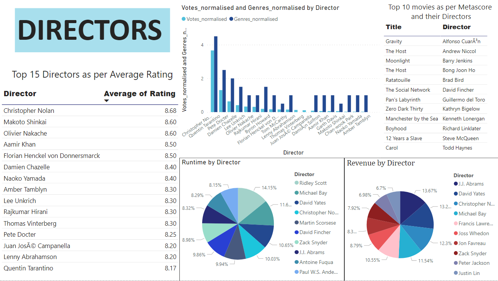
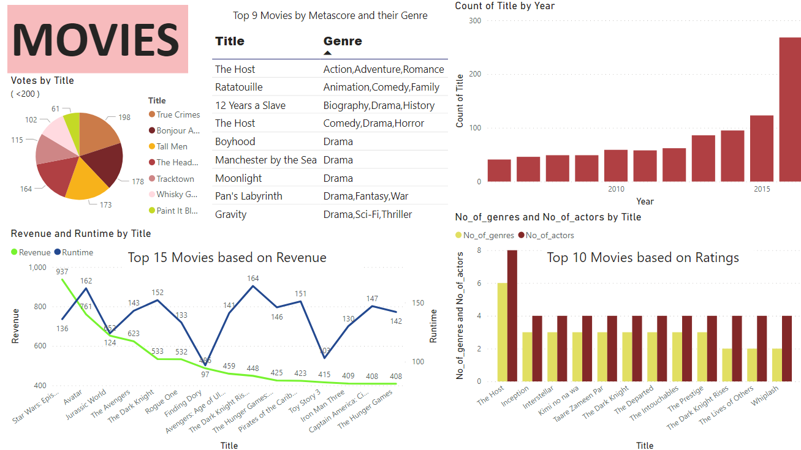

# IMDb-Movie-Data-Analysis-Power-BI

An interactive report on IMDb Movies dataset created using Power BI Desktop.

## Clean the dataset

<ol>
<li> The datatype of columns was changed. </li>
<li> Columns were renamed with appropriate headers. </li>
<li> A new column 'No_of_actors' was added which stores the number of actors starred in each movie. </li>
<li> A new column 'No_of_genres' was added which stores the number of genres the movie can be classified into. </li>
<li> Missing values in 'Revenue' column was replaced with it's mean. </li>
<li> All the rows having missing values were removed. </li>
</ol>

##  After cleaning, reports were made on 'Director' and 'Movie' attributes

### Directors 

### Movies 

